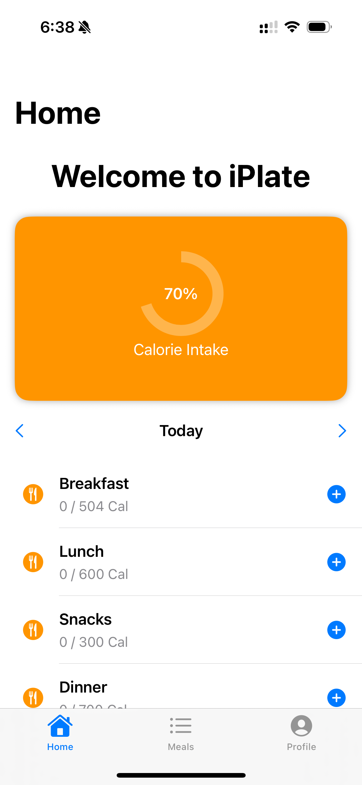
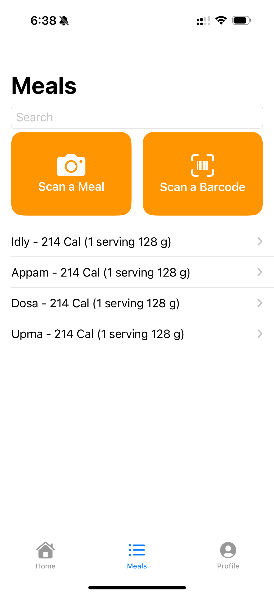
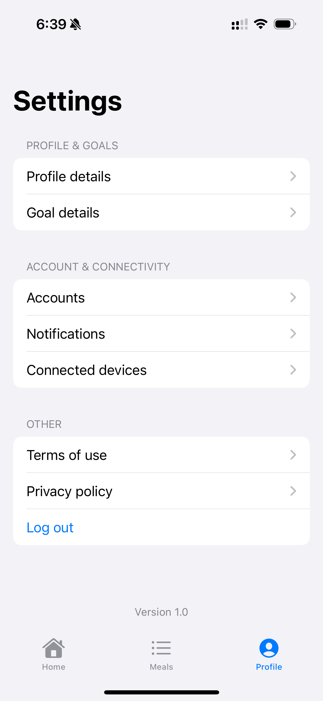

# iPlate

**iPlate** is a SwiftUI-based iOS application designed to help users track their meals and daily calorie intake. This project is a work in progress, featuring multiple views including a Home screen, Meals screen, and a Profile (Settings) screen. The app leverages SwiftData for persistence and demonstrates modern SwiftUI patterns.

## Features

- **Home Screen:**  
  - Displays an orange calorie card with a circular progress indicator.
  - Includes a date selector for navigating between days.
  - Lists meal categories (Breakfast, Lunch, Snacks, Dinner) with add buttons.

- **Meals Screen:**  
  - Contains a search field to filter meals.
  - Features scan cards for "Scan a Meal" and "Scan a Barcode" using SF Symbols.
  - Shows a list of previous meals with calorie information.

- **Profile Screen:**  
  - Presents a settings-like interface with sections for Profile & Goals, Account & Connectivity, and Other.
  - Includes a version display at the bottom.

## 📸 Screenshots

<div align="center">
  
  
  
</div>

## Installation

1. **Clone the repository:**

   ```bash
   git clone https://github.com/YOUR_USERNAME/iPlate.git
   cd iPlate
   ```

2. **Open the project in Xcode:**

   Double-click the `iPlate.xcodeproj` file to open it in Xcode.

3. **Build and Run:**

   Select your desired simulator or device, then click **Run** (or press ⌘R).

## Project Structure

```
iPlate/
├── iPlate.xcodeproj         # Xcode project file
├── iPlate/                  # App source folder
│   ├── Assets.xcassets      # App icons and images
│   ├── ContentView.swift    # Main view containing TabView integration
│   ├── HomeView.swift       # Home screen view
│   ├── MealsView.swift      # Meals screen view
│   ├── ProfileView.swift    # Profile/Settings screen view
│   ├── Item.swift           # SwiftData model
│   └── iPlateApp.swift      # App entry point
├── iPlateTests/             # Unit tests
└── iPlateUITests/           # UI tests
```

## Usage

- **Home Tab:**  
  Check out your daily calorie intake, navigate through days using the date selector, and add new meals.

- **Meals Tab:**  
  Use the search field to find meals, or tap on the scan cards to simulate scanning a meal or barcode. View previous meals from the list.

- **Profile Tab:**  
  Access settings-like features including profile details, goal information, accounts, notifications, and more.

## Dependencies

- **SwiftUI:** For building the user interface.
- **SwiftData:** For data persistence.

## Contributing

Contributions are welcome! Feel free to open an issue or submit a pull request if you have suggestions or improvements.

## License

This project is licensed under the MIT License. See the [LICENSE](LICENSE) file for details.

## Contact

For any questions or feedback, please contact [your-email@example.com].
